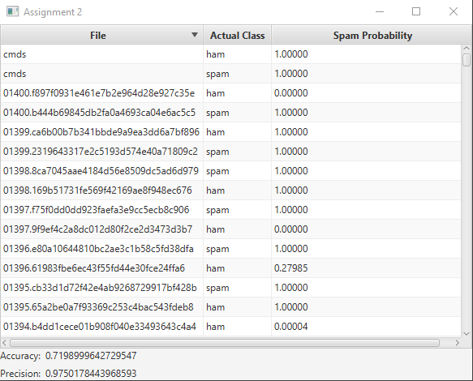

# CSCI2020u-assignemnt1 #
March 8th, 2021
Alexander Naylor 100696151

## Project Information ##
For this assignment I was given a dataset of emails, consisting of a training set and a testing set, both with known spam or not-spam emails. Using this data I created a psudo machine learning spam detection system based on an individual word's likleyhood of being in a spam file vs a not-spam file. Heres an example of it in action:

## Improvments ##
The main improvement I made was making a better file selection screen. I've also set up gradle for the program to make deployment easier.

## How to run ##
1. Clone the project using git to a directory of your choice.
2. Then using the provided gradle wrapper, run `./gradlew build` and `./gradlew run`.
3. Once the application starts up, use the file browsers to navigate to your test and training datasets. (Samples are included under the ./data folder.)(Note: for a directory to be valid, it must contain 2 subdirectories labled 'ham' and 'spam', and they must contain any number of text based files containing one email per file.)
4. Finaly, click the 'next' button, the program will take a moment to run, then it will appear with the results.